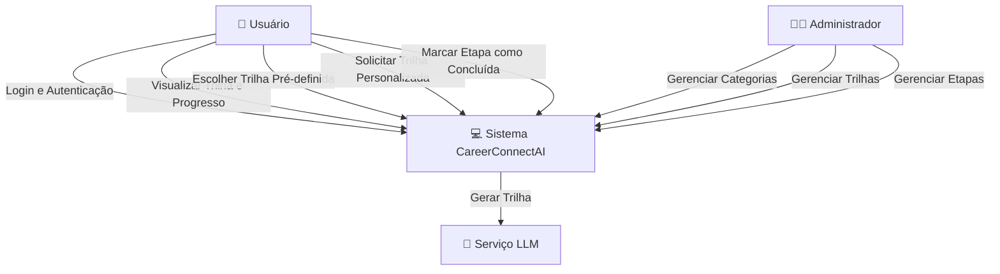
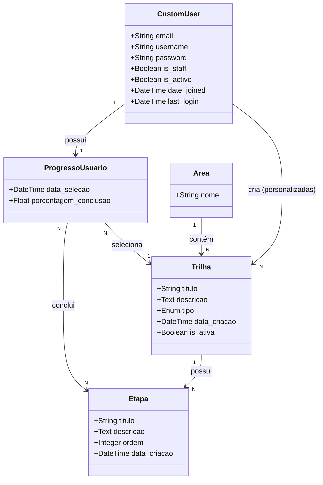
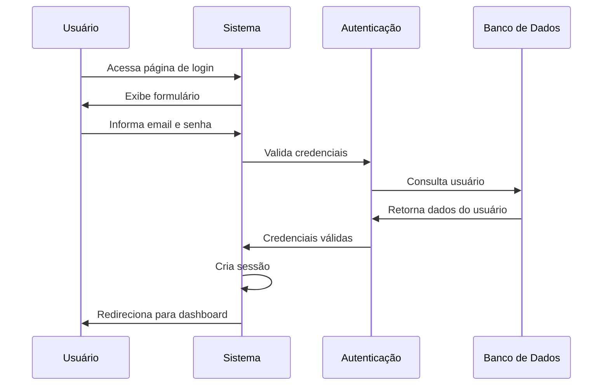
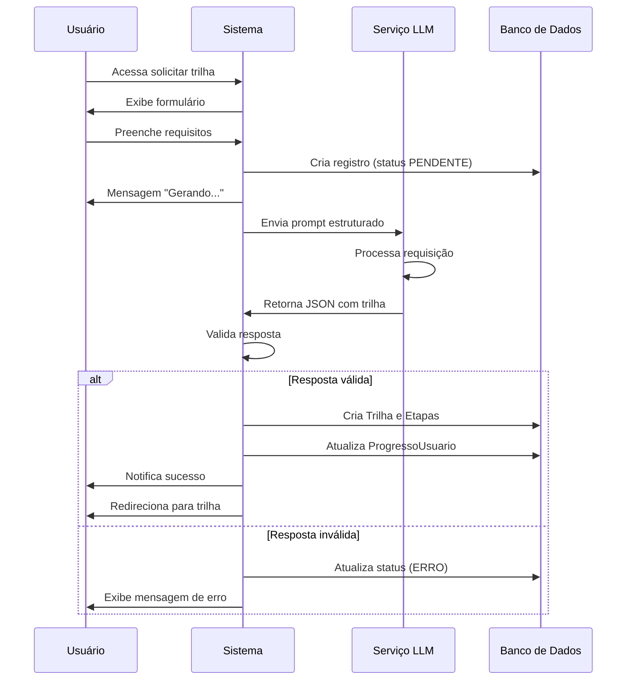
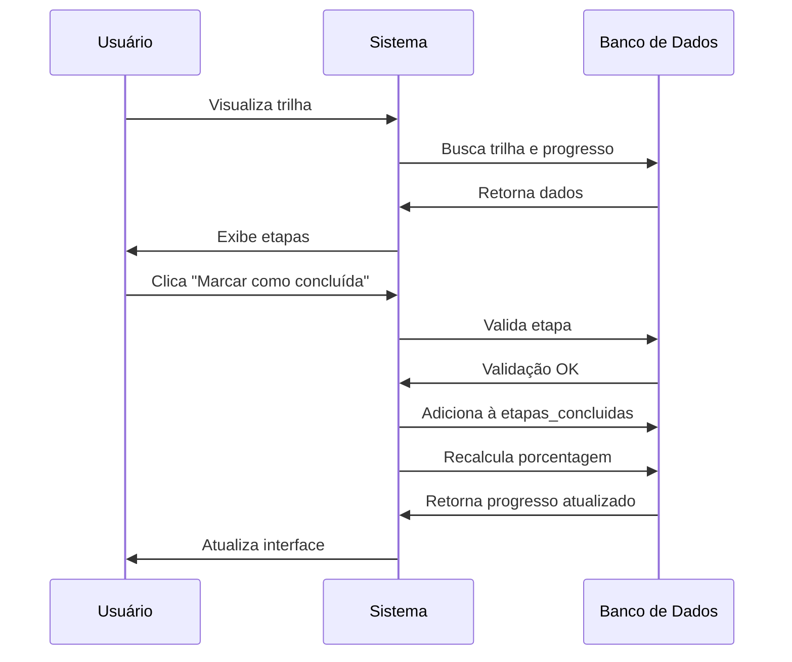
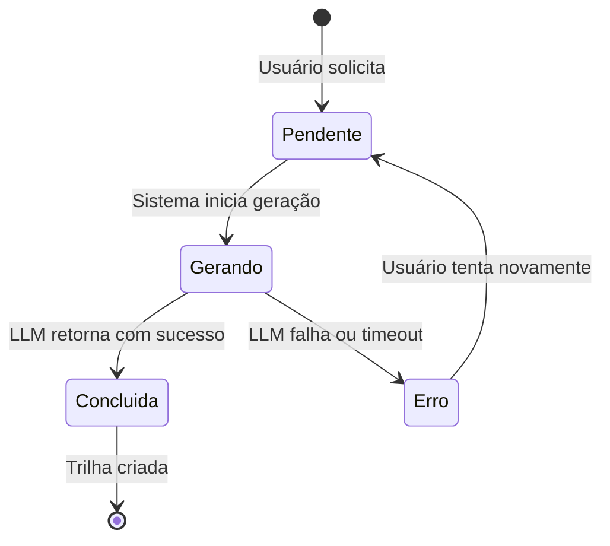
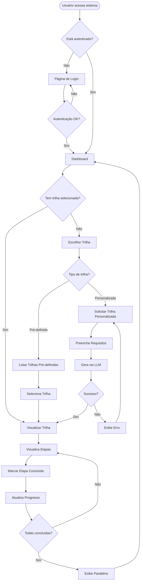
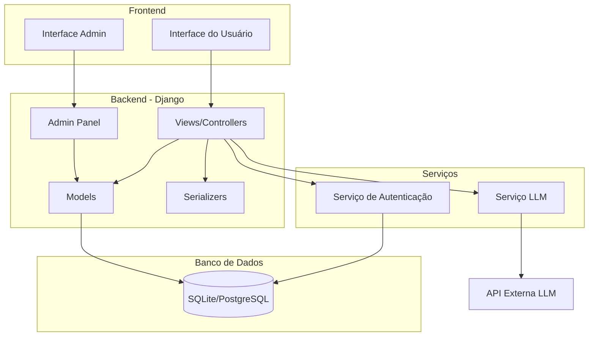
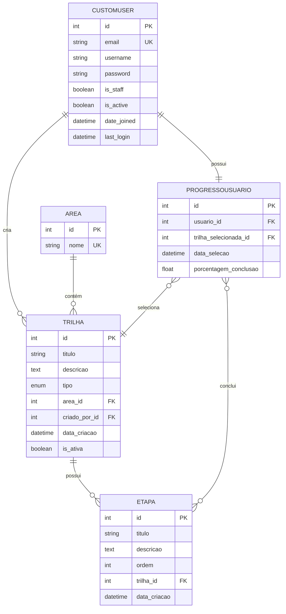

# Diagramas - CareerConnectAI

## Diagrama de Casos de Uso

## Diagrama de Classes do Domínio

## Diagrama de Sequência - Login

## Diagrama de Sequência - Solicitar Trilha Personalizada

## Diagrama de Sequência - Marcar Etapa Concluída

## Diagrama de Estados - Trilha Personalizada

## Diagrama de Atividades - Fluxo Completo do Usuário

## Diagrama de Componentes

## Diagrama de Entidade-Relacionamento (ER)

